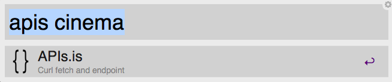

# [APIs.is](http://apis.is/) Alfred Workflow

A simple workflow to CURL endpoints from [APIs.is](http://apis.is/) in the almighty Terminal.

## How to use?

[Download the script](APIs.is.alfredworkflow) and double click it to launch it in Alfred.

To fetch endpoints, simple launch Alfred and type `apis {query}` where the `{query}` is the endpoint you wish to CURL. See APIs.is's [documentation](http://apis.is/) for complete list of endpoints.

## Get in touch

Follow me on twitter [@rthor](http://twitter.com/rthor) or send me a line in an [email](mailto:ragnar.valgeirsson@gmail.com).